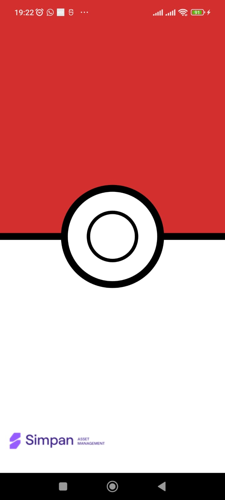

# pokedex_apps

**Deskripsi singkat**
Aplikasi Pokedex sederhana berbasis Flutter yang memanfaatkan GraphQL Pokemon API (`https://graphql-pokemon2.vercel.app/`). Aplikasi ini di-desain dengan GetX + arsitektur terpisah (domain / infrastructure / presentation) agar mudah diuji dan dipelihara.

---

 

## Struktur proyek (singkat)

Struktur ini merefleksikan folder yang ada di `lib/`:

```
lib/
  domain/
    core/
      constants/
      interfaces/
      utils/
  infrastructure/
    dal/
      repositories/
      services/
  navigation/
    bindings/
      controllers_bindings.dart
      home.controller.binding.dart
    controllers/
      home.controller.dart
    domains/
    navigation.dart
    routes.dart
  presentation/
    home/
      controllers/
        home.controller.dart
      home.screen.dart
    screens.dart
  theme/
  main.dart
```

Penjelasan singkat per layer:

* **domain**: entitas, interface repository, usecase. Logika bisnis murni.
* **infrastructure**: implementasi datasource, client GraphQL wrapper, DAO jika butuh local cache.
* **navigation**: binding GetX, route definition dan inisialisasi dependency.
* **presentation**: pages/screens, controllers GetX, widget UI.

---

## Requirement (development)

* Flutter SDK (stable) — rekomendasi: versi 3.x atau yang stabil terbaru saat development.
* Android SDK & toolchain untuk build APK.
* `flutter pub get` akan meng-install dependency.

**Dependencies utama yang direkomendasikan** (cek `pubspec.yaml` di repo):

* get: GetX (state / routing / DI)
* graphql\_flutter (GraphQL client)
* freezed / json\_serializable (opsional untuk model generation)
* cached\_network\_image
* flutter\_lints
* mocktail / mockito (testing)

---

## Cara build & run (development)

1. Clone repo

```bash
git clone <REPO_URL>
cd POKEDEX_APPS
```

2. Install dependency

```bash
flutter pub get
```

3. Run di device/emulator

```bash
flutter run
```

### Build APK (release)

```bash
flutter build apk --release
```

Jika ingin menghasilkan APK yang signed untuk distribusi, ikuti langkah signing Flutter standar (atur `key.properties`, `signingConfigs` di `android/app/build.gradle`).

---

## Konfigurasi GraphQL

Endpoint default yang digunakan:

```
https://graphql-pokemon2.vercel.app/
```

Contoh query pagination (ambil 20):

```graphql
query pokemons($first: Int!) {
      pokemons(first: $first) {
        id
        number
        name
        image
        types
      }
    }
```

Contoh query detail:

```graphql
query pokemon($name: String!) {
      pokemon(name: $name) {
        id
        number
        name
        image
        classification
        maxHP
        maxCP
        types
        resistant
        weaknesses
        height {
          minimum
          maximum
        }
        weight {
          minimum
          maximum
        }
        attacks {
          fast {
            name
            type
            damage
          }
          special {
            name
            type
            damage
          }
        }
        evolutions {
          id
          number
          name
          image
        }
      }
    }
```


## Testing

Jalankan unit & widget test:

```bash
flutter test
```

## App Preview

| Splashscreen | Home | Filter |
|--------------|------|--------|
|  |  |  |

| After Filter Yellow | After Filter Green | Detail About |
|-------------------|-----------------|--------------|
|  |  |  |

| Detail Base Stats | Evolution | Evolution 1 |
|-----------------|-----------|-------------|
|  |  |  |

| Evolution Expanded |
|------------------|
|  |

## Created by: Aldi Riansyah 👨‍💻

